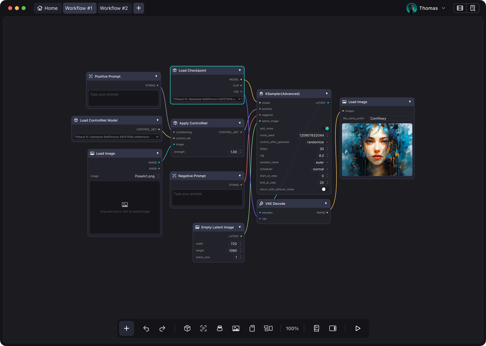
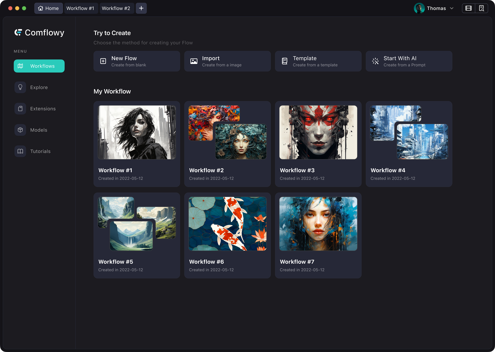

<h4>
    
    
    
</h4>

Comflowyspace is an open-source AI image and video generation tool committed to providing a better, 
interactive experience than the standard SDWebUI and ComfyUI. 

Many people are hesitant to learn about 
or participate in the wave of AI generation simply because the tools required are often too complex.  This is a problem that we're set on solving. We believe that it is crucial to develop an AI image 
and video generation tool that is both easier to use and more useful tool - **ComflowySpace**.

The goal of ComflowySpace is to make ComfyUI & Stable Diffusion accessible to all. 
From downloading and installing to plug-in management, 
workflow templates, and process editing, every step is well designed.

If you like ComflowySpace, give our repo a [⭐ Star](https://github.com/6174/comflowyspace) and [👀 Watch](https://github.com/6174/comflowyspace/subscription) our repository to stay updated.

## Download
* **MacOS:**  [Mac Intel](https://github.com/6174/comflowyspace/releases/download/v0.0.4-alpha/comflowy-0.0.4-alpha.dmg) | [Mac M](https://github.com/6174/comflowyspace/releases/download/v0.0.4-alpha/comflowy-0.0.4-alpha-arm64.dmg) 
* **Windows:**  Coming Soon

## Key Features
> If you want to know more about key features, feel free to check out our blog articles [ComflowySpace VS ComfyUI](https://www.comflowy.com/blog/comflowy-vs-comfyui).
* **More Convenient Installation**: Installing ComfyUI is complicated and often encounters various strange problems, leading to installation failure. To solve this problem, ComflowySpace offers a one-click installation feature so you can complete the installation within a few minutes.
* **More Efficient Usage**: ComflowySpace offers a workflow management feature, where you can view all your historical workflows. With it, you no longer need to manually export and save workflows. In addition, we also provide a multi-tab feature that allows you to open and run multiple workflows simultaneously, enhancing multitasking efficiency.
* **Simpler Setup**: In ComflowySpace, you can use various templates to build workflows, making workflow construction simpler and more convenient.
* **Friendlier User Experience**: We've optimized a great many detailed experiences to make your usage smoother. At the same time, ComflowySpace is integrated with our tutorials, reducing your learning threshold.

## Demo

## Contributing
We are grateful to the community for contributing bug fixes and improvements. For more information please read：
* [Development Guide](./DEVELEPMENT.md)

#### 😱 Found a bug?

Please [report all bugs](https://github.com/6174/comflowyspace/issues)! We are happy to fix the issues you have discovered. We also welcome you to join us in resolving the problem.

#### 🤔 Missing a certain feature?
If you think we are missing a feature, please feel free to submit an [Issue](https://github.com/6174/comflowyspace/issues). We will take it into serious consideration.

We also outline our development plans in the [Project](https://github.com/users/6174/projects/2). We also welcome everyone to build with us. If you are interested in this, please join our [Discord](https://discord.gg/xqB9VyEX) and get in touch with us.

## Thanks
This project exists thanks to all the people who contributed:

