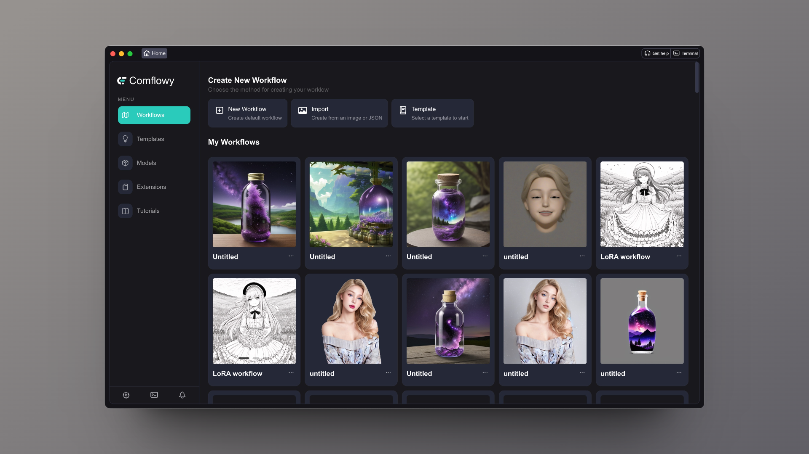

<h4>
    
    
    
</h4>

Comflowyspace is an open-source AI image and video generation tool committed to providing a better, 
interactive experience than the standard SDWebUI and ComfyUI. 

You can go to our [official website](https://www.comflowy.com) for more detials.

If you like ComflowySpace, give our repo a [⭐ Star](https://github.com/6174/comflowyspace) and [👀 Watch](https://github.com/6174/comflowyspace/subscription) our repository to stay updated.

## Download

* **MacOS:**
    * [Mac Intel](https://github.com/6174/comflowyspace/releases/download/v0.2.0-alpha/comflowy-0.2.0-alpha.dmg) (Note that if you have an Intel Macbook, make sure it has AMD graphics before installing, otherwise it won't work!)
    * [Mac M](https://github.com/6174/comflowyspace/releases/download/v0.2.0-alpha/comflowy-0.2.0-alpha-arm64.dmg)  
* **[Windows](https://github.com/6174/comflowyspace/releases/download/v0.2.0-alpha/comflowy-0.2.0-alpha.zip)**

## Cloud Version
If your computer's performance isn't sufficient for the local version, you can also try our [cloud version](https://www.comflowy.com).

The differences between cloud version and the local open-source version are:
1) It's pre-installed with various common extensions, so you don't have to worry about environment conflicts.
2) You can directly choose and use models from Civitai, eliminating the need to download them to your local machine.
3) Cloud GPU operation enables the execution of more complex workflows.

## Product Screenshots

## Contributing
We are grateful to the community for contributing bug fixes and improvements. For more information please read:
* [Development Guide](./DEVELEPMENT.md)
* [Contribution Guide](./CONTRIBUTION.md)

#### 😱 Found a bug?

Please [report all bugs](https://github.com/6174/comflowyspace/issues)! We are happy to fix the issues you have discovered. We also welcome you to join us in resolving the problem.

#### 🤔 Missing a certain feature?
If you think we are missing a feature, please feel free to submit an [Issue](https://github.com/6174/comflowyspace/issues). We will take it into serious consideration.

We also outline our development plans in the [Project](https://github.com/users/6174/projects/2). We also welcome everyone to build with us. If you are interested in this, please join our [Discord](https://discord.com/invite/cj623WvcVx) and get in touch with us.

## Thanks
This project exists thanks to all the people who contributed:

Additionally, I am very grateful for the contributions of the open-source community:

## Star History

